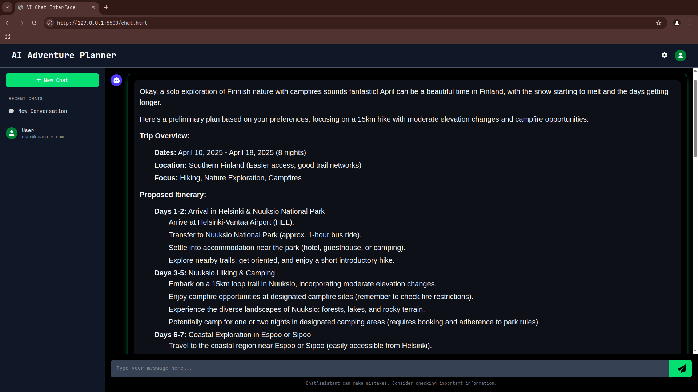

# ai-based-adventure-planner

A simple AI based adventure planner to help plan adventures and trips easily. 

---

## 🚀 Features

- Smart AI chat to plan your trips
- Form-based + free-form exploration
- Dark mode UI with markdown responses
- Built with HTML, Tailwind, JS, Node.js

---

## 📸 Demo

   

---

## 🛠️ Tech Stack

- Frontend: HTML, Tailwind CSS, JavaScript
- Backend: Node.js, Express
- AI: Google Gemini api

---

## 💡 How It Works

1. Choose your mode: either **chat with the AI** or **fill out a quick form**.
2. TrailBuddy processes your input and returns personalized plans.
3. Enjoy exploring!

---

